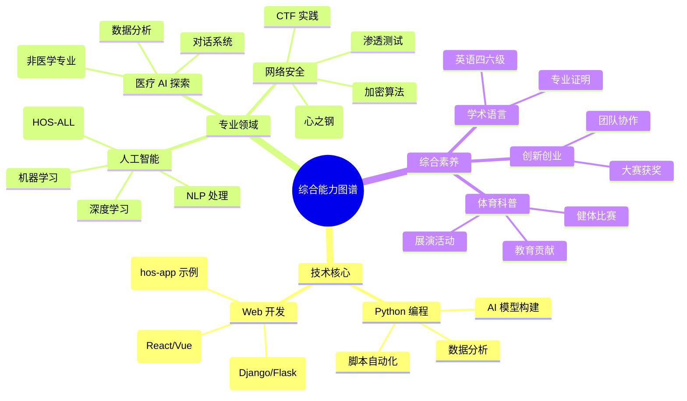

# RES-PJEXP 个人成果档案

## 📁 档案概述
RES-PJEXP 是钱佳宏的个人技术成果与证书档案库，专注于存储和展示在网络安全、人工智能、医疗健康等领域的学习成果、竞赛证书及技术认证。该档案库定期更新，以反映最新成就和项目进展。

### 在线技术 Profiles
为更好地展示技术贡献和开源项目，以下是我的在线平台链接及其关键内容总结。这些平台体现了我在安全、AI及相关领域的探索与贡献：

- **PyPI 仓库**：专注于安全工具和AI辅助库，已发布并维护 HOS-ME、BOS-HA、HOS-GREED、HOS-M2F、hos-vortex 等 5 个开源项目，涵盖办公自动化、手语识别、轻量化AI安全、文档转换及红队渗透等领域。[访问 PyPI 页面](https://pypi.org/user/security_hyacinth/)
- **GitHub 仓库**：核心代码托管平台，包含网络安全工具到AI实验的项目。精选仓库包括 pinned 项目：hos-app（三人团队训练营前端项目，展示 Web 开发技能）；HOS-ALL（五人团队 AI + 信息安全项目，参与 Intel AI 竞赛，使用 Python 实现）。这些项目突出团队协作与创新实践。[访问 GitHub](https://github.com/lxcxjxhx)
- **Hugging Face 模型库**：分享微调后的 AI 模型，聚焦信息安全、医疗及计算机视觉领域。[访问 Hugging Face](https://huggingface.co/lxcxjxhx)
- **CSDN 博客**：运营的技术博客 安全风信子 ，已发布超 700 篇文章，创建 7 个专栏，主题涵盖 AI、信息安全、Web3.0、运维开发等。获超 1.2 万点赞，原力等级 5 级，精选专栏包括“大模型+AIGC”、“信息安全CTF全题型&题解”，持续分享前沿技术洞见与实践。[访问博客](https://security-hyacinth.blog.csdn.net/)

## 📊 成果展示

### 证书认证
- **技术认证**：获得多项认证，包括 Intel 和携程证书。
- **竞赛奖项**：国家级/市级创新创业及科普奖。
- **学术证明**：英语四六级通过。

### 综合能力
- **创新创业**：参与创新大赛并获奖，展示领导力和创意。
- **体育健康**：健体比赛获奖，体现全面发展。
- **科普教育**：展演活动证书，突出教育贡献。

## 💼 技术技能

### 核心技术领域
- **Python 编程**：应用于脚本开发、数据分析及 AI 模型构建。
- **Web 开发**：涵盖前端框架（React/Vue）和后端服务（Django/Flask）。
- **网络安全**：渗透测试、加密算法、安全审计及 CTF 实践。
- **人工智能**：机器学习、深度学习及自然语言处理。
- **医疗数据分析**：生物信息学工具及健康数据可视化（AI 视角）。

### 综合能力图谱


## 📞 联系信息
- **档案所有者**：钱佳宏
- **联系方式**：手机号 19921057118 | 邮箱 aqfxz_zh@qq.com
- **内容概述**：个人学习成果与证书档案

## 🙏 致谢
感谢所有团队成员、指导老师及支持机构的无私贡献。


---


# RES-PJEXP Personal Achievements Archive

## 📁 Archive Overview
RES-PJEXP is Qian Jiahong's personal archive of technical achievements and certificates, focusing on storing and showcasing learning outcomes, competition certificates, and technical certifications in fields such as cybersecurity, artificial intelligence, and healthcare. This archive is regularly updated to reflect the latest achievements and project progress.

### Online Technical Profiles
To better showcase my technical contributions and open-source projects, the following are links to my online platforms and a summary of their key content. These platforms reflect my exploration and contributions in security, AI, and related fields:

- **PyPI Repository**: Focuses on security tools and AI-assisted libraries. Five open-source projects have been released and maintained: HOS-ME, BOS-HA, HOS-GREED, HOS-M2F, and hos-vortex, covering areas such as office automation, sign language recognition, lightweight AI security, document conversion, and red team penetration testing. [Visit PyPI page](https://pypi.org/user/security_hyacinth/)

- **GitHub Repository**: The core code hosting platform, containing projects ranging from cybersecurity tools to AI experiments. Featured repositories include pinned projects: hos-app (a three-person team bootcamp front-end project showcasing web development skills); HOS-ALL (a five-person team AI + information security project participating in the Intel AI competition, implemented using Python). These projects emphasize teamwork and innovative practices. [Visit GitHub](https://github.com/lxcxjxhx)

- **Hugging Face Model Library**: Sharing finely tuned AI models, focusing on information security, healthcare, and computer vision. [Visit Hugging Face](https://huggingface.co/lxcxjxhx)

- **CSDN Blog**: The technical blog "Security Hyacinth," with over 700 articles published and 7 columns covering topics such as AI, information security, Web3.0, and operations and development. With over 12,000 likes and a Force Level of 5, this blog features curated columns including "Large Models + AIGC" and "Information Security CTF All Question Types & Solutions," continuously sharing cutting-edge technical insights and practices. [Visit Blog](https://security-hyacinth.blog.csdn.net/)

## 📊 Achievements Showcase

### Certifications

- **Technical Certifications**: Multiple certifications, including Intel and Ctrip certificates.

- **Competition Awards**: National/municipal innovation, entrepreneurship, and science popularization awards.

- **Academic Certifications**: Passed CET-4 and CET-6.

### Comprehensive Abilities

- **Innovation and Entrepreneurship**: Participated in and won awards in innovation competitions, demonstrating leadership and creativity.

- **Physical Education and Health**: Won awards in physical fitness competitions, reflecting well-rounded development.

- **Science Popularization and Education**: Certificates for performance activities, highlighting educational contributions.

## 💼 Technical Skills

### Core Technology Areas

- **Python Programming**: Applied to script development, data analysis, and AI model building.

- **Web Development**: Covers front-end frameworks (React/Vue) and back-end services (Django/Flask).

- **Cybersecurity**: Penetration testing, encryption algorithms, security auditing, and CTF practices.

- **Artificial Intelligence**: Machine learning, deep learning, and natural language processing.

- **Medical Data Analysis**: Bioinformatics tools and health data visualization (AI perspective).

### Comprehensive Ability Map

```mermaid
mindmap

root((Comprehensive Ability Map))

Core Technologies

Python Programming

Data Analysis

AI Model Building

Script Automation

Web Development

Front-end Frameworks (React/Vue)

Back-end Services (Django/Flask)

Full-Stack Projects (HOS-app Example)

Professional Fields

Cybersecurity

Penetration Testing

Encryption Algorithms

CTF Practice

Platform Building (Heart Steel)

Artificial Intelligence

Machine Learning

Deep Learning

NLP Processing

Project Applications (HOS-ALL)

Medical AI Exploration

Dialogue Systems

Data Analysis

Model Training (Non-Medical Majors)

Comprehensive Qualities

Academic Languages

English CET-4/6

Professional Certifications

Innovation and Entrepreneurship

Competition Awards

Team Collaboration

Sports Popularization

Fitness Competitions

Performance Activities

Educational Contributions

```

## 📞 Contact Information

- **File Owner**: Qian Jiahong

- **Contact Information:** Mobile: 19921057118 | Email: aqfxz_zh@qq.com

- **Content Overview:** Personal learning achievements and certificate archive

## 🙏 Acknowledgements Thank you to all team members, instructors, and supporting institutions for their selfless contributions.
