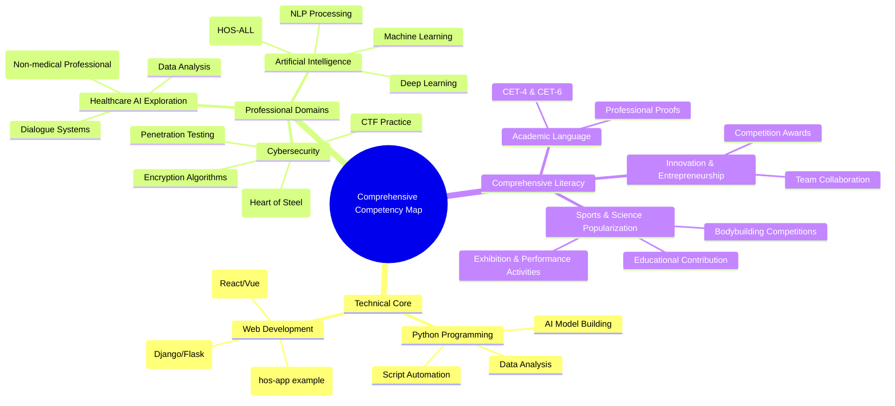

[![Release][(https://github.com/lxcxjxhx/Resume-and-personal-achievements/releases)](https://github.com/lxcxjxhx/Resume-and-personal-achievements/releases)
# RES-PJEXP Personal Achievement Portfolio

## 📁 Portfolio Overview
RES-PJEXP is Qian Jiahong's personal repository for technical achievements and certifications, focused on storing and showcasing learning outcomes, competition certificates, and technical certifications in fields such as cybersecurity, artificial intelligence, and healthcare. This portfolio is regularly updated to reflect the latest accomplishments and project progress.

### Online Technical Profiles
To better showcase technical contributions and open-source projects, here are the links to my online platforms along with summaries of their key contents. These platforms reflect my explorations and contributions in security, AI, and related fields:

- **PyPI Repository**: Focuses on security tools and AI-assisted libraries. Has published and maintains 5 open-source projects including HOS-ME, BOS-HA, HOS-GREED, HOS-M2F, and hos-vortex, covering areas like office automation, sign language recognition, lightweight AI security, document conversion, and red team penetration. [Visit PyPI Page](https://pypi.org/user/security_hyacinth/)
- **GitHub Repository**: Core code hosting platform containing projects from cybersecurity tools to AI experiments. Featured repositories include pinned projects: hos-app (a three-person team bootcamp front-end project demonstrating web development skills); HOS-ALL (a five-person team AI + Information Security project, participating in the Intel AI competition, implemented in Python). These projects highlight teamwork and innovative practices. [Visit GitHub](https://github.com/lxcxjxhx)
- **Hugging Face Model Hub**: Shares fine-tuned AI models, focusing on information security, healthcare, and computer vision fields. [Visit Hugging Face](https://huggingface.co/lxcxjxhx)
- **CSDN Blog**: Operates the technical blog "Security Hyacinth". Has published over 700 articles, created 7 columns covering topics such as AI, information security, Web3.0, and DevOps. Received over 12k likes, with a Creator Level 5. Featured columns include "Large Models + AIGC" and "Information Security CTF All Question Types & Solutions", continuously sharing insights and practices on cutting-edge technologies. [Visit Blog](https://security-hyacinth.blog.csdn.net/)

## 📊 Achievements Showcase

### Certifications & Accreditations
- **Technical Certifications**: Obtained multiple certifications, including Intel and Ctrip certificates.
- **Competition Awards**: National and municipal-level awards for innovation, entrepreneurship, and science popularization.
- **Academic Proofs**: Passed the CET-4 and CET-6 English proficiency tests.

### Comprehensive Competencies
- **Innovation & Entrepreneurship**: Participated in and won awards at innovation competitions, demonstrating leadership and creativity.
- **Sports & Health**: Won awards in bodybuilding competitions, reflecting well-rounded development.
- **Science Popularization & Education**: Certificates for exhibition and performance activities, highlighting contributions to education.

## 💼 Technical Skills

### Core Technical Domains
- **Python Programming**: Applied in script development, data analysis, and AI model building.
- **Web Development**: Covers front-end frameworks (React/Vue) and back-end services (Django/Flask).
- **Cybersecurity**: Penetration testing, encryption algorithms, security auditing, and CTF practice.
- **Artificial Intelligence**: Machine learning, deep learning, and natural language processing.
- **Healthcare Data Analysis**: Bioinformatics tools and health data visualization (from an AI perspective).

### Comprehensive Competency Map

## 📞 Contact Information
- **Portfolio Owner**: Qian Jiahong
- **Contact Details**: Phone 19921057118 | Email aqfxz_zh@qq.com
- **Content Summary**: Personal learning achievements and certification portfolio

## 🙏 Acknowledgments
Sincere gratitude to all team members, mentors, and supporting institutions for their selfless contributions.
